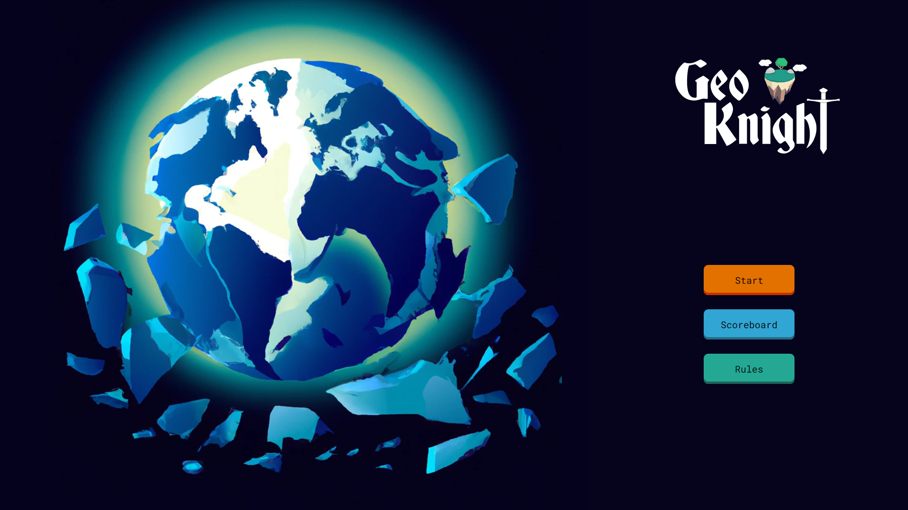

# GeoKnight



### The world is fracturing!

*This is the Dockerized version containing the GeoKnight [client](https://github.com/lanxeyu/GeoKnight-Client) and [server](https://github.com/lanxeyu/GeoKnight-Server) repos as submodules.*

Also playable on: https://geoknight.onrender.com


Welcome to **_EdVenturers'_** group project, GeoKnight. 
The school system failed, and it's up to you with your wealth of geographic knowledge to fend off the hordes to protect the world!

**GeoKnight** is a round-based game, where the user has to answer questions to boost their stats to fight off the enemy invaders. Stats can be boosted by choosing one of three categories in which, if answered correctly, grants you an increase to that respective stat.
You can also store your score at the end of each game!

## How to Play

1. Install [Docker](https://www.docker.com/)
2. Open GitBash terminal
3. Create a directory: ```mkdir <directory-name>```
4. Change into that directory: ```cd <directory-name>```
5. Clone the repo: ```git clone git@github.com:emptybagelman/GeoKnight-Dockerized.git```
6. Run command: ```docker compose up```    
7. In a browser, navigate to [localhost:8080](http://localhost:8080/)

To stop running the client and server, in your terminal, press 'Ctrl + C'
